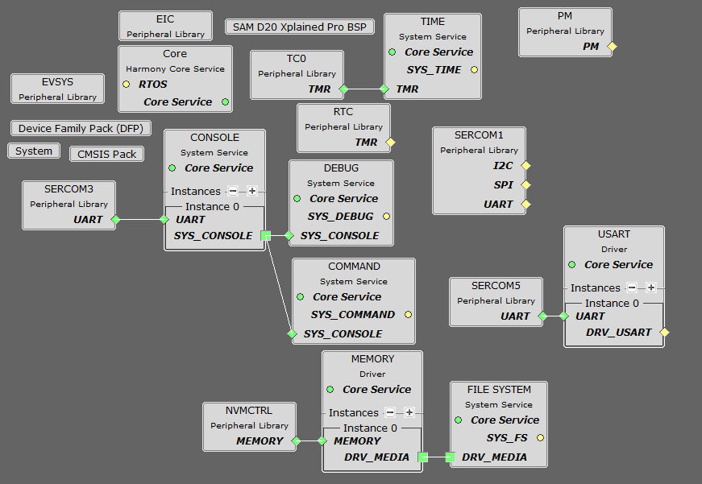
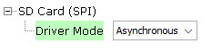

# ATM90Exx Metering Demo  

Devices: **| SAMD20 | ATM90E26 | ATM90E32 | ATM90E36 ** 
Features: **| METERING | **

## ⚠ Disclaimer  

<b>
THE SOFTWARE ARE PROVIDED "AS IS" AND GIVE A PATH FOR SELF-SUPPORT AND SELF-MAINTENANCE. This repository contains example code intended to help accelerate client product development.  

For additional Microchip repos, see: <a href="https://github.com/Microchip-MPLAB-Harmony" target="_blank">https://github.com/Microchip-MPLAB-Harmony</a>

Checkout the <a href="https://microchipsupport.force.com/s/" target="_blank">Technical support portal</a> to access our knowledge base, community forums or submit support ticket requests.

</b>

## Contents

1. [Introduction](#step1)
1. [Bill of materials](#step2)
1. [Hardware Setup](#step3)
1. [Software Setup](#step4)
1. [Harmony MCC Configuration](#step5) 
1. [Board Programming](#step6)
1. [Run the demo](#step7)
1. [Related Applications](#step8)

## 1. Introduction<a name="step1">  

This application example assists in the development of a project utilizing ATM90Exx devices.

ATM90Exx devices are used on AC electrical metering/measuring applications.

This example is based on the "Metering Demo Application" of Harmony3 "smartenergy_metrology" repository (see more information on <a href="https://github.com/Microchip-MPLAB-Harmony/smartenergy_metrology" target="_blank">https://github.com/Microchip-MPLAB-Harmony/smartenergy_metrology</a>), where some changes have to been done to adapt the application files to the platform.

The SAMD20-EK serves as a host device, collecting metrology and measurement data from the ATM90Exx DBs. The connection can be established via Serial Port or SPI when the ATM90E26-DB is connected, or through SPI for the ATM90E3xx-DB.

An OLED1_XPLAINED_PRO EK is used to display the information, switch between display windows, and notify events.

To provide the storage capabilities for saving the files defined in the application is used:

- ATM90E26: Internal NVM
- ATM90E32: SPI EEPROM (EEPROM-4 Click)
- ATM90E36: MICROSD (IO1 Xplained Pro)

The SAMD20-EK USB connector is used to interface with the Command Line and Console applications.

## 2.Application review<a name="step2">  

The approach involves replicating the functionalities of the **_SmartEnergy Metrology Driver_** (for more information, visit **_https://github.com/Microchip-MPLAB-Harmony/smartenergy_metrology_**). This is achieved by developing software for the ATM90EXX Controller with similar library interfaces and functionalities. Consequently, only minimal changes to the application files are required to adapt the Demometer Application to the new platform.

### ATM90EXX Metrology Controller

The ATM90EXX Metrology Controller has been developped in different layers and files.

#### ATM90EXX_HAL  

Defines the API interfaces necessary to access physically to ATM90EXX.
 - SPI/Serial access based on Harmony 3 SPI/USART Driver in synchronous mode 
 - Interrupts based on PLIB EIC 
 - Integration period Timer based on SYS TIME
 - PIO control based on PLIB PORT

Defined on atm90exx_hal.[c,h]. 

#### ATM90EXX_CTRL  

Provides an API interfaces similar to Smart Energy Metrology Driver to simplify the adaptation to metrology application.

Includes these features:
 - ATM90EXX Driver Management - Init/Open/Close/Start/Stop
 - ATM90EXX Configuration Capabilities (Task)
 - ATM90EXX Interrupts Handling and Notification of Events 
 - ATM90EXX Direct Register Read/Write
 - ATM90EXX Refresh Measurement/Metering Information (Task) 
 - Integration Period Notification to the application

Defined on atm90exx_drv.[c,h].

#### ATM90EXX_API  

Provides an API interface to:
 - Get ATM90EXX measurement/metrology information
 - Get/Set ATM90EXX configuration
 - Get ATM90EXX registers information

Defined on atm90exx_api.[c,h].

#### ATM90EXX_API_EVENTS  

Provides an API interface to:
- Enable/Disable ATM90EXX metrology events
- Configure thresholds that control metrology events
- Get metrology events through a callback

Defined on atm90exx_api_events.[c,h]. 

### Other Files  

 - atm90exx_conf.h: 
	- configures the ATM90EXX controller capabilities.

 - atm90exx_regs.[c,h]: 
	- Registers information, definition, and structures. 
	- Structures grouped to emulate "Smart Energy Metrology":
		- Control Registers: control, thresholds, calibration
		- Status Registers
		- Accumulator Registers: measuring and metering

- atm90exx_defs.h:
	- ATM90EXX definitions

#### Typical Flow using ATM90EXX Metrology Controller   

#### METROLOGY Library Abstraction Layer  

An additional abstraction layer has been introduced to unify the API interface from the perspective of applications when interfacing with different metrology implementations.

 - metrology_conf.h
	- configures the metrology capabilities.
 - metrology_api.[c,h]
	- Provides an API interface to: 
		- Management of metrology driver (open, close, ...)
		- Integration Period event callback
		- Get measurement/metrology information
		- Get/Set metrology configuration
		- Get metrology registers information
 - metrology_api_events.[c,h]
	- Provides an API interface to:
		- Enable/Disable metrology events
		- Configure thresholds that control metrology events
		- Get metrology events through a callback

### Applications  

This example is based on the "Metering Demo Application" from the Harmony3 "smartenergy_metrology" repository. For more information, please visit https://github.com/Microchip-MPLAB-Harmony/smartenergy_metrology. Some modifications have been made to adapt the application files to the platform..

It is recommended to review the "Metering Demo Application" documentation beforehand to understand the functionality of the application.

 
### METROLOGY Application adaptation  

The Demo Meter Metrology application has been updated to utilize the previously defined Metrology API. The application configures the metrology controller based on the ATM90EXX to obtain and refresh metrology and measurement parameters at each integration period (default is 5 seconds). This process is visually indicated by the toggling of the SAMD20-EK LED0 with each refresh. This event triggers the reading of energy and power, updating the information regarding energy demand, time-of-use (TOU), and events.

### DISPLAY Application adaptation  

The Demo Meter application has been updated to address the OLED1 XPLAINED PRO display (128x32 pixels).  

The Microchip "gfx_mono" library has been used to provide support to the Display functionalities defining the corresponding GFX_MONO_UG_2832HSWEG04.

The interface configuration to address the SSD1306 SPI controller that controls the LCD Display is defined on **gfx_definitions.h**

An additional abstraction layer has been included to provide the functions required by the application to display the different informations:

 - oled1_display.[c,h]

The sysfont selected is BPMONO_10x16 providing a full map of 2x16 characters.

The distribution of the information addresses:
 - Parameter String
 - Parameter Value
 - Event Notification - Not used
 - Parameter Value Units

Buttons:
 - Button 1 and 2 act like SCROLL_UP and SCROLL_DOWN.
 - Button 3 is not used but it's planned to implement TAMPER feature.

Leds:
 - LED1 updates with each serial port communication
 - LED2 and 3 are not used 

### DATALOG Application adaptation  

The application continues to utilize the Harmony3 DRV_MEMORY and FILESYSTEM configuration. Different options are evaluated depending on the platform:
- Internal NVM (ATM90E26)
- EEPROM SPI (ATM90E32)
- SDCard SPI (ATM90E36)

The filename for the metrology configuration has been updated to use the specific device name instead of "metrology" to prevent issues when addressing different ATM90EXX devices using the same hardware setup. 

## ENERGY Application adaptation  

The SUPC and Tamper event detection features are currently unavailable. Additionally, the process for detecting minute and month changes has been adjusted to align with the capabilities of the SAMD20 RTC.

## EVENTS Application adaptation  

New events have been defined according to the detection capabilities of the ATM90EXX within the specified structure, but they are not yet handled by the application.

## CONSOLE Application adaptation  

Most of the commands are available with the same parameters. The register information for the ATM90EXX has been organized to mirror the structure of the "SmartEnergy Metrology Driver" (control, status, and accumulator registers).

Additional Commands:
 - System (SYS): allows to configure the System Log Level. Helps in the development/debug process.

### OTHER Adaptations  

### Additional features pending to implement  

 - [ ] Support for common format for measurement/metering parameters
 - [ ] Support for Set Configuration Registers (DCW, DCM command line)
 - [ ] Support for Direct Access to Read/Write Registers from Command Line (DRR, DRW)
 - [ ] Support for ATM90EXX-GUI access
 - [ ] Support for Calibration (CAL command line)
 - [ ] Support for THD & Harmonic Analysis (HAR, HRR command line)
 - [ ] Real testing with AC signals

## 2. Bill of Materials<a name="step2">  

 | Tools | Quantity |
 | --    | --       |
 | [ATSAMD20-XPRO](https://www.microchip.com/en-us/development-tool/atsamd20-xpro) | 1 |
 | [ATM90E26-DB](https://www.microchip.com/en-us/development-tool/atm90e2x-db) | 1 |
 | [ATM90E32AS-DB](https://www.microchip.com/en-us/development-tool/atm90e32as-db) | 1 |
 | [ATM90E36A-DB](https://www.microchip.com/en-us/development-tool/atm90e36a-db) | 1 |
 | [ATOLED1-XPRO](https://www.microchip.com/en-us/development-tool/atoled1-xpro) | 1 |
 | [EEPROM 4-CLICK](https://www.mikroe.com/eeprom-4-click) | 1 |
 | [ATMBUSADAPTER-XPRO](https://www.microchip.com/en-us/development-tool/atmbusadapter-xpro) | 1|
 | [ATIO1-XPRO](https://www.microchip.com/en-us/development-tool/atio1-xpro) | 1 |
 
## 3. Hardware Setup<a name="step3">  

 - On ATM90E32 platform, an EEPROM 4-CLICK is attached to SAMD20-EK using a ATMBUSADAPTER-XPRO connected in the EXT1.

  - On ATM90E36 platform, an ATIO1-XPRO is attached to SAMD20-EK EXT1.

 - ATOLED1-XPRO is connected to SAMD20-EK on EXT2. Previously the ATOLED1-XPRO connector has been flipped to allow the extension using a direct cable connection.

 - ATM90EXX-DB is connected to SAMD20-EK on EXT3. 
	- On the ATM90EXX-DB, the jumper that controls the RST pin must be removed to avoid to keep in reset the ATM90EXX (the pin corresponds with GND on the Xplained Pro connector).

- ATM90E26 Hardware Setup:

- ATM90E32 Hardware Setup:

- ATM90E36 Hardware Setup:

## 4. Software Setup<a name="step4">  

The project has been developped with:  

 - [MPLAB X IDE ](https://www.microchip.com/en-us/tools-resources/develop/mplab-x-ide#tabs)  
	- Version: 6.20
	- XC32 Compiler v4.45
	- MPLAB® Code Configurator version 5.5.0
	- MPLAB® Code Configurator core version 5.7.0
	- SAMD20_DFP v3.6.112
	- MCC Harmony
	- csp version: v3.20.0
	- core version: v3.14.1
	- bsp version: v3.21.0
	- CMSIS_5: v5.9.0	  
	- dev_packs: v3.14.0
	
 - Any Serial Terminal application like [TERA TERM](https://teratermproject.github.io/) terminal application  

 - [MPLAB IPE](https://microchipdeveloper.com/ipe:installation)  
 
## 5. Harmony MCC Configuration<a name="step5">  

### Getting Started with Demo Meter using ATM90EXX  

New users of MCC MPLAB go through the [overview](https://onlinedocs.microchip.com/pr/GUID-1F7007B8-9A46-4D03-AEED-650357BA760D-en-US-6/index.html?GUID-AFAB9227-B10C-4FAE-9785-98474664B50A).  

**Step 1**  

Connect the Demo Meter platform to the device/system using a micro-USB cable connected to the SAMD20-EK USB connector.

**Step 2**  

Select the corresponding project according with the expected configuration on the firmware folder.

 - metering_demo_atm90e26_serial_samd20

 - metering_demo_atm90e26_spi_samd20

 - metering_demo_atm90e32_spi_samd20

 - metering_demo_atm90e36_spi_samd20

**Step 3**  

Open Harmony MCC Configuration to check the configuration.

- metering_demo_atm90e26_serial_samd20

- metering_demo_atm90e26_spi_samd20

- metering_demo_atm90e32_spi_samd20

- metering_demo_atm90e36_spi_samd20

**Step 4** - Clock Configuration  

The clock configuration is common to all projects.  

The external 32.765Khz XTAL is used as reference for RTC peripheral and internal 8Mhz oscillator is used for the rest of the system.  

**Step 5** - RTC Configuration  

The RTC configuration is common to all projects. The peripheral is configured in Clock/Calendar mode.

**Step 6** - Time System Configuration  

The system time is used working with the TC0. A 1mseg resolution is enough to implement the delays and timings on that application.

**Step 7** - System Console, Commands and Debug Configuration  

System Console, command line and debug system use the same SERCOM configured as serial port that is accesible on the SAMD20-EK USB Connector.

**Step 8** - Display Configuration  

The OLED1 Xplained PRO includes a SSD1306 SPI controller to address the LCD Display.  
The Buttons 1 and 2 are scroll up/down the contents of the LCD.  
Button 3 has been planned to simulate a tamper event but it has not been implemented.  
LED1 shows serial port activity.  
LED2-3 are not used but can notify events.  

Interrupts Configuration:

**Step 9** - Storage Configuration  

The storage subsystem is based on a standard MCC File System Block (FAT32) running on:  

 - Internal NVM using MCC NVMCTRL + Memory Driver (asynchronous mode)

 - SPI EEPROM using MCC Microchip AT25 Driver (attached to SERCOM 0)  + Memory Driver (asynchronous mode)

 - SDCard using standard MCC Microchip SD Card (SPI) Driver (using SERCOM 0)

**Step 10** - ATM90EXX Interface Configuration  

The ATM90EXX device is addresed using a SERCOM configured like Serial/SPI. In both cases, the access is configured using USART/SPI Drivers in _**synchronous**_ mode to be compatible with any other Microcontroller architecture:
 - ATM90E26 supports both Serial/SPI interfaces
 - ATM90E3X support only SPI interface (higher clk speed)

Other Important PINs:

 - ATM90E26: Reset, IRQ and WARN interrupts, Usel (SPI/Serial selection)

 - ATM90E3X: Reset, IRQs, PM (Power Mode selection), DMA_CTRL

Interrupts configuration:

**Step 10**  

[Generate](https://onlinedocs.microchip.com/pr/GUID-1F7007B8-9A46-4D03-AEED-650357BA760D-en-US-6/index.html?GUID-2EE03524-41FE-4EBA-8646-6D10AA72F365) the code if any change need to be done.

**Step 11**  

Clean and build the project. To run the project, select "Make and program device" button.

## 6. Board Programming<a name="step6">

### Program the precompiled hex file using MPLAB X IPE

- The Precompiled hex file is given in the hex folder.
Follow the steps provided in the link to [program the precompiled hex file](https://microchipdeveloper.com/ipe:programming-device) using MPLABX IPE to program the pre-compiled hex image. 

### Build and program the application using MPLAB X IDE

The applications folder can be found by navigating to the following path: 

- "../firmware/"

## 7. Run the Demo<a name="step7">

## ⚠ Disclaimer
As the board is not isolated if the ATM90EXX-DB is going to be connected to real AC sources:
- an USB-Isolator is mandatory between the SAMD20-EK USB connector and the PC.
- an isolated tool must be used to interact with any button.

Connect an USB to uUSB cable to the SAMD20-EK board:
- Baud rate: 115200
- Parity: None
- Data bits: 8
- Stop bits: 1
- Com port: COM USB serial port 

The system starts configuring the board with a default configuration and requesting information from ATM90EXX device each integration period (SAMD20-EK LED0 toggles with integration period periodicity).

Send a "HELP" command 

Read the metrology control registers.

Interact with OLED1 Xplained pro Buttons and observe the Display information.

Learn by interacting with the command line:

## 8. Related Information<a name="step8">

More information can be found in:

- [ATM90E26 Datasheet](https://ww1.microchip.com/downloads/aemDocuments/documents/OTH/ProductDocuments/DataSheets/Atmel-46002-SE-M90E26-Datasheet.pdf)
- [ATM90E26 Application Note](https://ww1.microchip.com/downloads/en/Appnotes/Atmel-46102-SE-M90E26-ApplicationNote.pdf)
- [ATM90E26 HW & SW Design Documentation](https://ww1.microchip.com/downloads/aemDocuments/documents/SE/ProductDocuments/BoardDesignFiles/ATM90E2x_V1.16.zip)
- [ATM90E32 Datasheet](https://ww1.microchip.com/downloads/aemDocuments/documents/OTH/ProductDocuments/DataSheets/Atmel-46003-SE-M90E32AS-Datasheet.pdf)
- [ATM90E32 Application Note](https://ww1.microchip.com/downloads/en/AppNotes/Atmel-46103-SE-M90E32AS-ApplicationNote.pdf)
- [ATM90E36 Datasheet](https://ww1.microchip.com/downloads/en/DeviceDoc/Atmel-46004-SE-M90E36A-Datasheet.pdf)
- [ATM90E36 Application Note](https://ww1.microchip.com/downloads/aemDocuments/documents/OTH/ApplicationNotes/ApplicationNotes/Atmel-46104-SE-M90E36A-ApplicationNote.pdf)
- [ATM90E3x HW & SW Design Documentation](https://ww1.microchip.com/downloads/aemDocuments/documents/SE/ProductDocuments/BoardDesignFiles/ATM90E3x_V1.05.zip)
- [ATM90EXX Autocalibration](https://ww1.microchip.com/downloads/aemDocuments/documents/SE/ProductDocuments/BoardDesignFiles/AutoCalibration_Ver1.0.zip)

